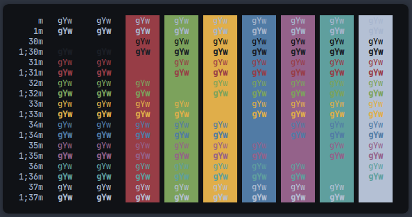
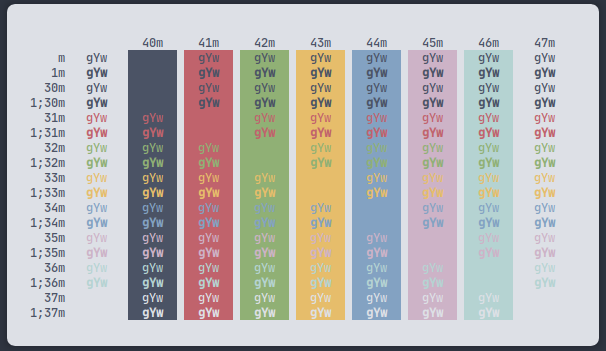

# Mountain

This is a color palette inspired by the famous Nord one

# Colors
## Night (Dark Variant)
suitable for nearly anything.
| **Color** | **Hex value** | **Colors Name** | **Preview** |
| ----- | --------- | ------------ | ------- |
| Background | #101216 | Woodsmoke |  |
| Foreground | #a7b5cd | Casper Variant |  |
| Black | #232730 | Charade |  |
| Red | #973d46 | SolidPink |  |
| Green | #7ca25c | Asparagus |  |
| Yellow | #e0ae4a | Anzac |  |
| Blue | #517ba5 | Wedgewood |  |
| Magenta | #94628a | Strikemaster |  |
| Cyan | #5f9f9e | Breaker Bay |  |
| White | #b4c0d4 | Casper |  |

### Dark Shades
| **Color** | **Hex value** | **Colors Name** | **Preview** |
| ----- | --------- | ------------ | ------- |
| Dark 1 | #101216 | Woodsmoke |  |
| Dark 2 | #1B1E25 | Shark |  |
| Dark 3 | #232730 | Charade |  |
| Dark 4 | #313743 | Bright Gray  |  |
| Dark 5 | #4b5365 | River Bed |  |

### Light Shades
| **Color** | **Hex value** | **Colors Name** | **Preview** |
| ----- | --------- | ------------ | ------- |
| Ligth 1 | #83a2c2 | Nepal |  |
| Light 2 | #8fa1bf | Nepal Variant |  |
| Light 3 | #a7b5cd | Casper Variant |  |
| Light 4 | #b4c0d4 | Casper |  |
| Light 5 | #d6deed | Periwinkle Gray |  |

### Other colors
| **Color** | **Hex value** | **Colors Name** | **Preview** |
| ----- | --------- | ------------ | ------- |
| Orange| #d39924 | Nugget |  |

### Variants
these colors needs to be refined but here's some light and dark variations of the one used for the original colorscheme
| **Color** | **Hex value** | **Colors Name** | **Preview** |
| ----- | --------- | ------------ | ------- |
| D RED | #742f37 | --- |  |
| RED | #973D46 | --- |  |
| L RED | #b8515b | --- |  |
| D GREEN | #638349 | --- |  |
| GREEN | #7ca25c | --- |  |
| L GREEN | #96b67c | --- |  |
| D YELLOW | #d19723 | --- |  |
| YELLOW | #e0ae4a | --- |  |
| L YELLOW | #e7c073 | --- |  |
| D BLUE | #406182 | --- |  |
| BLUE | #517ba5 | --- |  |
| L BLUE | #6f94b8 | --- |  |
| D MAGENTA | #744e6d | --- |  |
| MAGENTA | #94628a	 | --- |  |
| L MAGENTA | #a97ea1 | --- |  |
| D MAGENTA | #4d807f | --- |  |
| MAGENTA | #5f9f9e	 | --- |  |
| L MAGENTA | #80b3b2 | --- |  |

## Snow (Light Variant)

suitable for nearly anything.
| **Color** | **Hex value** | **Colors Name** | **Preview** |
| ----- | --------- | ------------ | ------- |
| Background | #dde0e6 | Mishka |  |
| Foreground | #232730 | Bright Gray |  |
| Black | #4b5365 | River Bed |  |
| Red | #c0636c | Contessa |  |
| Green | #90b075 | Olivine |  |
| Yellow | #e6bd6b | Equator |  |
| Blue | #83a2c2 | Nepal |  |
| Magenta | #cdb3c7 | Lily |  |
| Cyan | #b5d3d2 | Jet Stream |  |
| White | #d6deed | Periwinkle Gray |  |
# Preview

## Night

## Light

